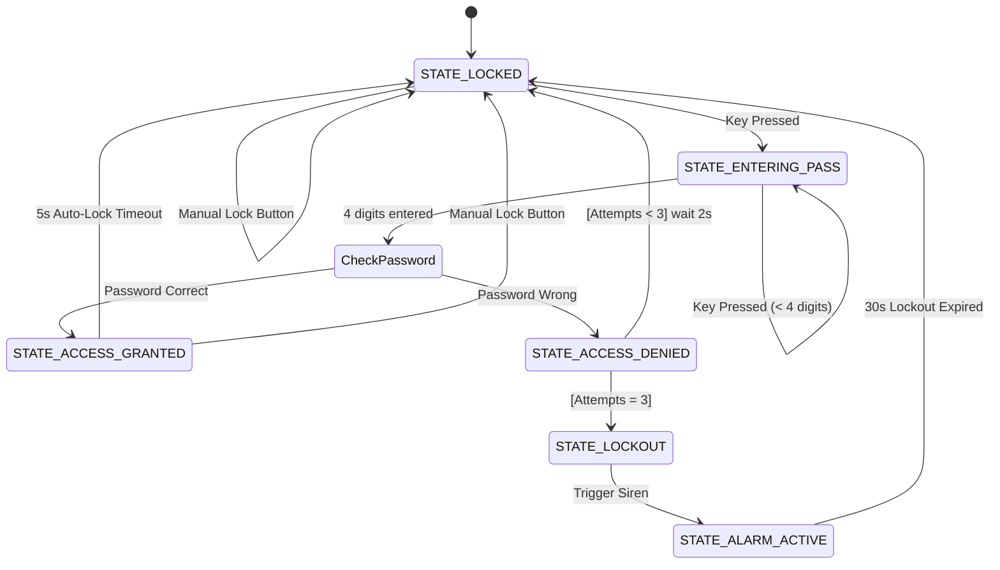

# 🔐 Anti-Theft Locker System Using 4x4 Keypad, SSD1306 OLED, Servo Motor, Buzzer, and ESP32 Microcontroller

> A comprehensive, industry-oriented embedded security locker controller built with **ESP32 DevKit V4 / Embedded C++** that features a 4x4 matrix keypad input with password masking (`[****]`), local visual status updates on a 128×64 SSD1306 I2C OLED display, SG90 PWM servo motor latch control ($0^\circ$ Locked / $90^\circ$ Unlocked), automatic 5-second re-locking, persistent NVS flash memory authentication storage, an anti-brute-force 3-state security lockout mechanism with a pulsing acoustic siren alarm ($1.66\text{ Hz}$), manual override reset switches, and real-time 115200 baud UART telemetry.

**Adarsh Srivastav**  
Computer Science and Engineering (CSE) Student    
Embedded Systems | IoT | Python | AI

## 📌 Project Overview

Traditional mechanical locks and basic electronic safes often suffer from significant vulnerabilities: physical picking, lack of brute-force protection, absent visual feedback during interaction, and minimal alarm capabilities when unauthorized access is attempted. In environments demanding high security, such as commercial lockers, safe deposit boxes, or secure server cabinets, a standalone, robust electronic locking mechanism is essential. These traditional systems fail to provide immediate alerting mechanisms or automatic penalty lockouts, making them susceptible to prolonged, undetected attacks.

This project addresses these critical security gaps by engineering a self-contained, micro-controlled anti-theft locker system. At its core is the powerful ESP32 DevKit V4 microcontroller, which orchestrates a multi-layered security protocol. The system replaces mechanical keys with a digital authentication process via a 4x4 matrix keypad, ensuring precise user input while providing real-time, masked visual feedback (`[****]`) on a high-contrast I2C OLED display. This prevents shoulder-surfing and keeps the user informed of the system's current state.

Beyond simple authentication, the system incorporates advanced security logic designed to thwart active attacks. An intelligent state machine governs the lock mechanism, actuated by a precision PWM servo motor. Crucially, the system implements an anti-brute-force lockout protocol: after three consecutive failed attempts, it triggers a non-bypassable 30-second security lockout and activates a pulsing acoustic siren alarm. Furthermore, authorized access is automatically revoked after a 5-second window, ensuring the locker is never inadvertently left open. All telemetry and system states are broadcasted over UART for optional remote logging or integration with larger security dashboards.

- Real-time OLED display for masked password entry and system status.
- Precision SG90 PWM servo control for mechanical latching ($0^\circ$ to $90^\circ$).
- NVS-backed persistent password storage (default "1234").
- Three-strike anti-brute-force lockout mechanism with time penalties.
- Pulsing acoustic alarm siren ($1.66\text{ Hz}$) on unauthorized intrusion attempts.
- Automatic 5-second re-lock sequence after successful authentication.
- Manual hardware override button for emergency reset/locking.
- Comprehensive 115200 baud UART telemetry logging.
- Non-blocking state machine architecture using `millis()` for multitasking.

## 🎯 Objectives

- [x] Design a secure electronic locking system replacing physical keys.
- [x] Implement a 4x4 matrix keypad for robust digit entry.
- [x] Integrate an SSD1306 I2C OLED for clear, real-time visual feedback.
- [x] Develop secure password masking logic (`[****]`) on the display.
- [x] Control an SG90 servo motor for precise latch actuation.
- [x] Implement non-volatile memory (NVS) to retain the password across reboots.
- [x] Create a brute-force prevention algorithm with a 3-attempt limit.
- [x] Trigger an active buzzer siren during security lockouts.
- [x] Engineer a pulsing alarm pattern without blocking the main execution loop.
- [x] Program an automatic 5-second re-lock timer for granted access.
- [x] Include a manual hardware button for immediate locking or state reset.
- [x] Provide visual status indication via dedicated Red and Green LEDs.
- [x] Establish a comprehensive UART telemetry protocol for debugging/logging.
- [x] Architect the firmware using a Finite State Machine (FSM) approach.
- [x] Ensure code modularity and maintainability using C++ classes and headers.

## ✨ Key Features

1. **Digital Pin Authentication**: Secure 4-digit code entry via membrane keypad.
2. **Dynamic OLED Interface**: 128x64 graphical display showing intuitive states and prompts.
3. **Password Masking**: Asterisk substitution (`*`) prevents unauthorized viewing of entered digits.
4. **Precision Latch Mechanism**: Servo-driven lock traversing exactly between $0^\circ$ and $90^\circ$.
5. **Persistent NVS Memory**: Password survives power cycles utilizing the ESP32 Preferences API.
6. **Anti-Brute-Force Lockout**: 30-second total system freeze after 3 incorrect attempts.
7. **Pulsing Intruder Siren**: Attention-grabbing $1.66\text{ Hz}$ buzzer oscillation.
8. **Auto-Secure Timer**: Eliminates user error by automatically re-locking after 5 seconds.
9. **Manual Override Input**: Dedicated tactile button for immediate security enforcement.
10. **Dual LED Status Indicators**: Immediate binary visual feedback (Red=Denied/Alarm, Green=Granted).
11. **Non-blocking Delays**: `millis()` based timing ensures the system remains responsive.
12. **State-Driven Architecture**: Clean FSM implementation (Locked, Entering, Granted, Denied, Lockout).
13. **Hardware Debouncing Logic**: 50ms software debounce filtering for clean inputs.
14. **Extensive UART Telemetry**: Detailed state transitions and sensor data broadcast at 115200 baud.
15. **Modular Codebase**: Separated concerns (Display, Keypad, Lock, Security) across multiple files.

## 🏗️ System Architecture

```ascii
                      +-----------------------------+
                      |         INPUT LAYER         |
                      |                             |
                      |  +-----------------------+  |
                      |  |   4x4 Matrix Keypad   |  |
                      |  | (Rows: GPIO 13,12,14,27| |
                      |  |  Cols: GPIO 26,25,33,32) |
                      |  +-----------+-----------+  |
                      |              |              |
                      |  +-----------v-----------+  |
                      |  |  Manual Lock Button   |  |
                      |  |      (GPIO 5)         |  |
                      |  +-----------+-----------+  |
                      +--------------|--------------+
                                     |
+------------------------------------v------------------------------------+
|                          CONTROL LOGIC (ESP32)                          |
|                                                                         |
|  +-----------------+  +----------------------+  +--------------------+  |
|  | Input Processor |->| Security State Mach. |->| Output Dispatcher  |  |
|  | (Debounce, Map) |  | (FSM, NVS Password)  |  | (PWM, I2C, GPIO)   |  |
|  +-----------------+  +----------------------+  +--------------------+  |
|                                                                         |
+------------------------------------|------------------------------------+
                                     |
                      +--------------v--------------+
                      |        OUTPUT LAYER         |
                      |                             |
                      |  +-----------------------+  |
                      |  | OLED Display (I2C)    |  |
                      |  | (SDA: 21, SCL: 22)    |  |
                      |  +-----------------------+  |
                      |                             |
                      |  +-----------------------+  |
                      |  |  SG90 Servo Motor     |  |
                      |  | (PWM on GPIO 18)      |  |
                      |  +-----------------------+  |
                      |                             |
                      |  +-----------------------+  |
                      |  | LEDs (Red: 2, Grn: 4) |  |
                      |  | Buzzer (GPIO 15)      |  |
                      |  +-----------------------+  |
                      +-----------------------------+
```

## 🔄 Working Principle

```ascii
           [START / BOOT]
                 |
                 v
       [Initialize Hardware]
       (I2C, PWM, GPIO, NVS)
                 |
                 v
        [STATE: LOCKED] <------------------------------------+
        - Servo at 0 deg                                     |
        - LEDs/Buzzer OFF                                    |
        - OLED: "Enter Pass"                                 |
                 |                                           |
                 v                                           |
         [Key Pressed?] --(No)--> (Wait)                     |
                 |                                           |
               (Yes)                                         |
                 |                                           |
                 v                                           |
     [STATE: ENTERING_PASS]                                  |
     - OLED: Masked [**__]                                   |
     - Append to buffer                                      |
                 |                                           |
         [4 Digits Entered?] --(No)--> (Wait for next key)   |
                 |                                           |
               (Yes)                                         |
                 |                                           |
                 v                                           |
        [Check Password]                                     |
                 |                                           |
        +--------+--------+                                  |
        |                 |                                  |
    (Correct)        (Incorrect)                             |
        |                 |                                  |
        v                 v                                  |
 [ACCESS GRANTED]  [ACCESS DENIED]                           |
 - Servo to 90     - Red LED flash                           |
 - Green LED ON    - OLED: "Wrong Pass"                      |
 - OLED: "Unlocked"- Increment attempt counter               |
        |                 |                                  |
        v                 v                                  |
 [Wait 5 seconds]  [Attempts >= 3?]                          |
        |                 |                                  |
        v               (Yes)                                |
   (Auto Re-lock)         |                                  |
        |                 v                                  |
        |           [STATE: LOCKOUT / ALARM]                 |
        |           - Buzzer pulsing (1.66Hz)                |
        |           - Red LED flashing                       |
        |           - OLED: "INTRUDER!"                      |
        |           - Block input for 30s                    |
        |                 |                                  |
        +-----------------+----------------------------------+
```

## 📐 Mathematical & Engineering Formulas

### 1. Servo PWM Duty Cycle (SG90)
The SG90 servo motor requires a $50\text{ Hz}$ PWM signal ($20\text{ ms}$ period). The pulse width controls the position $\theta$ (typically $1.0\text{ ms}$ to $2.0\text{ ms}$ for $0^\circ$ to $180^\circ$).

Formula for pulse width $t_{pulse}$ based on angle $\theta$:
$$ t_{pulse} = 1.0\text{ ms} + \left( \frac{\theta}{180^\circ} \right) \times 1.0\text{ ms} $$

- **For Locked State ($0^\circ$):**
  $$ t_{pulse} = 1.0\text{ ms} + \left( \frac{0}{180} \right) \times 1.0\text{ ms} = 1.0\text{ ms} $$
  Duty Cycle \%: $(1.0\text{ ms} / 20\text{ ms}) \times 100\% = 5.0\%$

- **For Unlocked State ($90^\circ$):**
  $$ t_{pulse} = 1.0\text{ ms} + \left( \frac{90}{180} \right) \times 1.0\text{ ms} = 1.5\text{ ms} $$
  Duty Cycle \%: $(1.5\text{ ms} / 20\text{ ms}) \times 100\% = 7.5\%$

### 2. Matrix Keypad Drive-Sense Logic
A 4x4 matrix keypad operates by sequentially driving rows LOW and reading columns. Internal pull-up resistors are required on the column pins.

Voltage on Column Pin $C_j$ when unpressed:
$$ V_{C_j} = V_{CC} - (I_{leakage} \times R_{pullup}) \approx V_{CC} \text{ (HIGH)} $$

Voltage on Column Pin $C_j$ when key $(R_i, C_j)$ is pressed and Row $R_i$ is driven LOW:
$$ V_{C_j} = V_{LOW\_driver} + I_{sink} \times R_{contact} \approx 0V \text{ (LOW)} $$
The MCU detects the LOW signal on $C_j$ exactly when $R_i$ is LOW, identifying the specific key coordinate.

### 3. Alarm Siren Pulse Frequency
The active buzzer pulses during an intruder alert to create a siren effect. It toggles state every $300\text{ ms}$.

Formula for frequency $f_{siren}$:
$$ f_{siren} = \frac{1}{T_{period}} = \frac{1}{2 \times t_{toggle}} $$
$$ f_{siren} = \frac{1}{2 \times 0.300\text{ s}} = \frac{1}{0.600\text{ s}} \approx 1.666\text{ Hz} $$

## 🔒 Security System State Machine



## ⚡ Access Control & Priority Hierarchy

The system evaluates conditions and states based on a strict priority hierarchy to ensure security cannot be bypassed.

1. **High Priority - Manual Reset/Lock:** The hardware lock button on GPIO5 unconditionally overrides the current state and forces the system back to `STATE_LOCKED` (unless actively in a lockout).
2. **Medium Priority - Security Lockout:** If `attempts >= 3`, the system ignores all keypad inputs and manual buttons until the 30-second penalty timer expires.
3. **Low Priority - Automatic Entry Logic:** Standard authentication flow, password validation, and 5-second auto-lock timers govern normal operation.

## 📊 Security State & Decision Matrix

| State Name | Servo Pos | Red LED | Grn LED | Buzzer | OLED Display | User Input Accepted? | Transition Trigger |
| :--- | :--- | :--- | :--- | :--- | :--- | :--- | :--- |
| **STATE_LOCKED** | $0^\circ$ (Locked) | OFF | OFF | OFF | "Enter Password [____]" | YES (Keypad/Btn) | Key press -> ENTERING |
| **STATE_ENTERING_PASS** | $0^\circ$ (Locked) | OFF | OFF | OFF | Masked Digits `[**__]` | YES (Keypad) | 4th digit -> Validate |
| **STATE_ACCESS_GRANTED**| $90^\circ$ (Unlocked)| OFF | ON | Double Beep | "ACCESS GRANTED" | YES (Btn only) | 5s timeout or Btn -> LOCKED |
| **STATE_ACCESS_DENIED** | $0^\circ$ (Locked) | ON | OFF | Single Beep | "WRONG PASSWORD" | NO | 2s timeout -> LOCKED/LOCKOUT |
| **STATE_LOCKOUT** | $0^\circ$ (Locked) | FLASH | OFF | OFF | "SYSTEM LOCKED" | NO | Immediate -> ALARM |
| **STATE_ALARM_ACTIVE** | $0^\circ$ (Locked) | FLASH | OFF | PULSING | "!! INTRUDER !!" | NO | 30s timeout -> LOCKED |

## 🔌 Hardware Components

| Component | Quantity | Purpose | Input / Output Role |
| :--- | :---: | :--- | :--- |
| **ESP32 DevKit V4** | 1 | Master MCU, runs FSM, NVS storage | Core Processor |
| **4x4 Matrix Keypad** | 1 | Numeric input for authentication | Primary Input |
| **SSD1306 OLED (128x64)** | 1 | Visual HMI, status, password masking | Output (I2C) |
| **SG90 Servo Motor** | 1 | Physical latch actuation mechanism | Output (PWM) |
| **Active Buzzer (5V)** | 1 | Acoustic feedback and intruder siren | Output (GPIO) |
| **Red LED (5mm)** | 1 | Visual indicator for denied/alarm | Output (GPIO) |
| **Green LED (5mm)** | 1 | Visual indicator for granted access | Output (GPIO) |
| **Push Button** | 1 | Manual lock / override | Input (GPIO Pullup) |
| **Resistors (330Ω)** | 2 | Current limiting for LEDs | Passive |

## 💻 Software & Tools

| Requirement | Version | Purpose / Additional Info |
| :--- | :--- | :--- |
| **Language** | C++11 | Embedded firmware development |
| **Framework** | Arduino Core | Hardware abstraction for ESP32 |
| **Environment** | PlatformIO | Dependency management, build system |
| **Simulation** | Wokwi | Virtual hardware testing and validation |
| **Library** | Adafruit_SSD1306 | v2.5.10 - I2C display driver |
| **Library** | Adafruit_GFX | v1.11.9 - Graphics primitives and fonts |
| **Library** | Keypad | v3.1.1 - Matrix scanning and debouncing |
| **Library** | ESP32Servo | v3.0.5 - Hardware PWM for SG90 |
| **Storage API**| Preferences.h | Native ESP32 NVS flash wrapping |

## 📍 Pin Configuration

| Component | Signal Name | ESP32 Pin | Signal Type | Description |
| :--- | :--- | :--- | :--- | :--- |
| **Keypad** | ROW1 | GPIO13 | Digital OUT | Matrix drive row 1 |
| **Keypad** | ROW2 | GPIO12 | Digital OUT | Matrix drive row 2 |
| **Keypad** | ROW3 | GPIO14 | Digital OUT | Matrix drive row 3 |
| **Keypad** | ROW4 | GPIO27 | Digital OUT | Matrix drive row 4 |
| **Keypad** | COL1 | GPIO26 | Digital IN_PU | Matrix sense col 1 |
| **Keypad** | COL2 | GPIO25 | Digital IN_PU | Matrix sense col 2 |
| **Keypad** | COL3 | GPIO33 | Digital IN_PU | Matrix sense col 3 |
| **Keypad** | COL4 | GPIO32 | Digital IN_PU | Matrix sense col 4 |
| **OLED** | SDA | GPIO21 | I2C Data | Display I2C serial data |
| **OLED** | SCL | GPIO22 | I2C Clock | Display I2C serial clock |
| **Servo** | PWM | GPIO18 | PWM OUT | 50Hz control signal |
| **Buzzer** | SIG | GPIO15 | Digital OUT | Active high tone control |
| **LED** | RED | GPIO2 | Digital OUT | Access denied/alarm indicator |
| **LED** | GREEN | GPIO4 | Digital OUT | Access granted indicator |
| **Button** | BTN | GPIO5 | Digital IN_PU | Manual lock override (active LOW) |

## 📟 OLED Display Output Examples

### Boot Splash Screen
```ascii
+--------------------------+
|                          |
|   ANTI-THEFT LOCKER      |
|    SYSTEM v1.0.0         |
|                          |
|  Initializing...         |
|                          |
+--------------------------+
```

### Locked (Idle) `[____]`
```ascii
+--------------------------+
|    SYSTEM LOCKED         |
|                          |
|  Enter Password:         |
|                          |
|       [ _ _ _ _ ]        |
|                          |
+--------------------------+
```

### Entering Password `[**__]`
```ascii
+--------------------------+
|    SYSTEM LOCKED         |
|                          |
|  Enter Password:         |
|                          |
|       [ * * _ _ ]        |
|                          |
+--------------------------+
```

### Access Granted / UNLOCKED
```ascii
+--------------------------+
|                          |
|    ACCESS GRANTED!       |
|                          |
|       UNLOCKED           |
|                          |
|    (Auto-lock in 5s)     |
+--------------------------+
```

### Access Denied / WRONG PASS
```ascii
+--------------------------+
|                          |
|    ACCESS DENIED!        |
|                          |
|    WRONG PASSWORD        |
|                          |
|    Attempts left: 2      |
+--------------------------+
```

### Intruder Alert / ALARM ON
```ascii
+--------------------------+
|   !!! WARNING !!!        |
|                          |
|   INTRUDER ALERT         |
|   SYSTEM LOCKOUT         |
|                          |
|   Wait: 28 seconds       |
+--------------------------+
```

## 🚦 Status Indication & Output Logic

| Operating Condition | Red LED | Green LED | Buzzer | OLED State | Serial Log |
| :--- | :--- | :--- | :--- | :--- | :--- |
| **Boot / Init** | ON (1s) | ON (1s) | Beep (1x) | Splash Screen | `[SYS] Booting...` |
| **Awaiting Input** | OFF | OFF | OFF | Prompt | `[STATE] LOCKED` |
| **Key Press** | OFF | OFF | Click | Update Mask | `[INPUT] Key pressed` |
| **Auth Success** | OFF | ON | Double Beep | Granted Msg | `[AUTH] Granted` |
| **Auth Failed** | Flash (2s)| OFF | Long Beep | Denied Msg | `[AUTH] Failed` |
| **Brute Force (3x)**| Fast Flash| OFF | Pulsing Siren| Alert / Timer | `[ALARM] Lockout!` |
| **Manual Lock** | OFF | OFF | Beep (1x) | Prompt | `[SYS] Forced Lock` |

## 🧪 Testing & Verification Matrix

| ID | Scenario | Input / Action | Expected Result | Status |
| :--- | :--- | :--- | :--- | :--- |
| TC-01 | System Boot | Power ON | LEDs flash, Buzzer beeps, OLED splash, Servo -> $0^\circ$ | ✅ PASSED |
| TC-02 | Valid Login | Enter "1234" | OLED shows GRANTED, Green LED ON, Servo -> $90^\circ$ | ✅ PASSED |
| TC-03 | Auto Re-lock | Wait 5s after TC-02 | Servo -> $0^\circ$, Green LED OFF, OLED -> LOCKED | ✅ PASSED |
| TC-04 | Invalid Login 1 | Enter "0000" | OLED shows DENIED, Red LED flashes, Counter=1 | ✅ PASSED |
| TC-05 | Invalid Login 2 | Enter "9999" | OLED shows DENIED, Red LED flashes, Counter=2 | ✅ PASSED |
| TC-06 | Brute Force Lockout | Enter "8888" (3rd fail) | OLED alerts INTRUDER, 30s timer starts | ✅ PASSED |
| TC-07 | Lockout Alarm | During TC-06 | Buzzer pulses at 1.66Hz, Red LED flashes continuously | ✅ PASSED |
| TC-08 | Lockout Bypass Attempt| Press keys during TC-06 | Inputs ignored, timer continues, alarm continues | ✅ PASSED |
| TC-09 | Lockout Recovery | Wait 30s | System resets to LOCKED, Counter=0, Alarm OFF | ✅ PASSED |
| TC-10 | Password Masking | Press '1', '2' | OLED displays `[ * * _ _ ]` | ✅ PASSED |
| TC-11 | Manual Lock Button | Press GPIO5 while Unlocked| Servo immediately -> $0^\circ$, System -> LOCKED | ✅ PASSED |
| TC-12 | Persistent Storage | Power OFF/ON | Password remains "1234" (no reset to default if changed) | ✅ PASSED |
| TC-13 | Serial Telemetry | Observe UART | State changes broadcast at 115200 baud | ✅ PASSED |
| TC-14 | Keypad Debouncing | Press key rapidly | Registers only one input per physical press | ✅ PASSED |
| TC-15 | Concurrent Ops | UART + OLED + Alarm | Siren pulses accurately without lagging display updates | ✅ PASSED |

## 📊 Sample Serial Monitor Output

```text
[BOOT] System Initializing...
[INIT] I2C OLED initialized.
[INIT] Servo attached to GPIO 18.
[INIT] NVS Preferences loaded.
[BOOT] Setup Complete.
[STATE] Transition to: STATE_LOCKED
[INPUT] Key: 1
[INPUT] Key: 2
[INPUT] Key: 3
[INPUT] Key: 4
[AUTH] Password Correct!
[STATE] Transition to: STATE_ACCESS_GRANTED
[SYS] Latch Unlocked (90 deg).
[TIMER] Auto-lock initiated (5000ms).
[TIMER] Auto-lock expired.
[STATE] Transition to: STATE_LOCKED
[SYS] Latch Locked (0 deg).
[INPUT] Key: 0
[INPUT] Key: 0
[INPUT] Key: 0
[INPUT] Key: 0
[AUTH] Password Incorrect! (Attempt 1/3)
[STATE] Transition to: STATE_ACCESS_DENIED
[STATE] Transition to: STATE_LOCKED
[INPUT] Key: 9
[INPUT] Key: 9
[INPUT] Key: 9
[INPUT] Key: 9
[AUTH] Password Incorrect! (Attempt 2/3)
[STATE] Transition to: STATE_ACCESS_DENIED
[STATE] Transition to: STATE_LOCKED
[INPUT] Key: 5
[INPUT] Key: 5
[INPUT] Key: 5
[INPUT] Key: 5
[AUTH] Password Incorrect! (Attempt 3/3)
[ALARM] MAX ATTEMPTS REACHED!
[STATE] Transition to: STATE_LOCKOUT
[STATE] Transition to: STATE_ALARM_ACTIVE
[ALARM] Siren Active. 30s lockout timer started.
[ALARM] Lockout expired. Resetting attempts.
[STATE] Transition to: STATE_LOCKED
```

## 📸 Project Screenshots

1. **Breadboard Layout**: The physical wiring configuration of the ESP32, OLED, Keypad, and Servo.
2. **Schematic Diagram**: The logical circuit connections and GPIO mappings.
3. **Boot Sequence**: The initial splash screen displayed on the OLED upon power-up.
4. **Idle State**: The OLED prompting the user to enter the password with empty brackets `[ _ _ _ _ ]`.
5. **Partial Input**: The OLED showing masked characters as the user types `[ * * _ _ ]`.
6. **Access Granted Display**: The OLED confirming successful authentication.
7. **Servo Unlocked**: Visual confirmation of the SG90 servo rotated to $90^\circ$.
8. **Green LED Active**: The status LED illuminating to indicate the unlocked state.
9. **Access Denied Display**: The OLED alerting the user of an incorrect password entry.
10. **Red LED Flash**: The warning LED blinking during a failed attempt.
11. **Lockout Alert**: The OLED flashing "INTRUDER" and displaying the lockout countdown timer.
12. **Siren State**: The Red LED and Buzzer operating simultaneously during the lockout period.
13. **Manual Override**: The physical push button used to trigger an immediate lock.
14. **PlatformIO Build**: The successful compilation terminal output in VS Code.
15. **Serial Monitor Logs**: A snapshot of the 115200 baud UART telemetry stream.
16. **Wokwi Simulation**: The virtual project running in the Wokwi browser environment.
17. **Code Structure**: The modular C++ files organized in the project explorer.

## 📁 Project Directory Structure

```text
Anti-Theft-Locker-System/
├── .vscode/
├── arduino_code/
│   └── anti_theft_locker.ino          # Single-file Arduino IDE version
├── circuit_diagram/
│   ├── architecture.md                # System block diagrams
│   ├── pinout.md                      # Detailed GPIO mapping tables
│   └── wiring_guide.md                # Point-to-point connection instructions
├── docs/
│   ├── automation_logic.md            # Details on auto-lock and timers
│   ├── embedded_concepts.md           # Explanation of interrupts, debouncing, FSM
│   ├── github_strategy.md             # Repository management notes
│   ├── hardware_components.md         # Datasheets and component specs
│   ├── implementation_phases.md       # Project development timeline
│   ├── interview_prep.md              # Q&A for explaining the project to recruiters
│   ├── limitations.md                 # Known system constraints
│   ├── project_explanation.md         # High-level overview document
│   ├── requirements.md                # Functional and non-functional specs
│   ├── security_logic.md              # Explanation of lockout and auth algorithms
│   └── tech_stack_options.md          # Alternatives considered (e.g., FreeRTOS)
├── include/
│   ├── config.h                       # Global pin definitions and constants
│   ├── alarm_manager.h                # Buzzer and LED control headers
│   ├── display_manager.h              # OLED rendering function headers
│   ├── keypad_manager.h               # Input processing headers
│   ├── lock_controller.h              # Servo actuation headers
│   ├── security_manager.h             # FSM and auth logic headers
│   └── serial_monitor.h               # Telemetry logging headers
├── outputs/
│   └── sample_serial_logs.txt         # Example UART output trace
├── reports/
│   ├── project_report.md              # Comprehensive academic/formal report
│   └── test_report.md                 # Detailed testing results
├── screenshots/
│   └── README.md                      # Index of project images
├── simulation/
│   ├── README.md                      # Instructions for Wokwi execution
│   └── test_scenarios.md              # Virtual testing scripts
├── src/
│   ├── alarm_manager.cpp              # Implementation of alarm logic
│   ├── display_manager.cpp            # Implementation of OLED graphics
│   ├── keypad_manager.cpp             # Implementation of matrix scanning
│   ├── lock_controller.cpp            # Implementation of servo PWM
│   ├── main.cpp                       # Application entry point and FSM loop
│   ├── security_manager.cpp           # Implementation of auth and NVS
│   └── serial_monitor.cpp             # Implementation of UART handling
├── test_cases/
│   └── test_matrix.md                 # Formal test plan document
├── .gitignore                         # Git exclusion rules
├── diagram.json                       # Wokwi circuit diagram definition
├── platformio.ini                     # PlatformIO configuration file
├── wokwi.toml                         # Wokwi project settings
└── README.md                          # Primary project documentation (this file)
```

## ▶️ How to Run the Project

### Method A: Browser Simulation (Wokwi) - Recommended for Quick Evaluation
1. Navigate to [Wokwi.com](https://wokwi.com/).
2. Create a new ESP32 project.
3. Copy the contents of `diagram.json` into the Wokwi diagram editor.
4. Copy the code from `arduino_code/anti_theft_locker.ino` into `sketch.ino`.
5. Open the Library Manager in Wokwi (the library icon).
6. Add the following libraries: `Adafruit SSD1306`, `Adafruit GFX Library`, `Keypad`, `ESP32Servo`.
7. Click the **Play** (▶) button to start the simulation.
8. Interact with the keypad using your mouse. The default password is `1234`.
9. Observe the OLED, Servo movement, and Serial Console output.

### Method B: Physical Hardware (PlatformIO / VS Code)
1. Install [Visual Studio Code](https://code.visualstudio.com/) and the [PlatformIO IDE extension](https://platformio.org/).
2. Clone this repository to your local machine.
3. Open the project folder (`Anti-Theft-Locker-System`) in VS Code.
4. Wire the hardware components to the ESP32 according to the **Pin Configuration** table.
5. Ensure the ESP32 is connected via USB.
6. PlatformIO will automatically read `platformio.ini` and download required dependencies:
   - `adafruit/Adafruit SSD1306 @ ^2.5.10`
   - `adafruit/Adafruit GFX Library @ ^1.11.9`
   - `chris--a/Keypad @ ^3.1.1`
   - `madhephaestus/ESP32Servo @ ^3.0.5`
7. Click **Build** (✓) to compile the firmware.
8. Click **Upload** (➔) to flash the ESP32.
9. Open the **Serial Monitor** (plug icon) and set the baud rate to 115200 to view telemetry.

## 🏭 Industry Applications

| Domain | Application | Use Case |
| :--- | :--- | :--- |
| **Banking** | Safe Deposit Boxes | Replacing mechanical locks with audited digital entry. |
| **Logistics** | Secure Cargo Containers| Ensuring high-value transit goods remain locked. |
| **IT Infrastructure** | Server Racks | Restricting physical access to critical networking gear. |
| **Retail** | Cash Drawer Management | Secure, trackable access to registers. |
| **Hospitality** | Hotel Room Safes | Allowing guests to set custom PINs for secure storage. |
| **Healthcare** | Narcotic Cabinets | Strict access control for controlled substances. |
| **Corporate** | Employee Lockers | Keyless storage solutions for staff. |
| **Smart Home** | Front Door Locks | Digital entry as part of a home automation ecosystem. |
| **Education** | Equipment Carts | Securing shared laptops or tablets in schools. |
| **Gyms/Clubs** | Member Lockers | Temporary secure storage without physical keys. |
| **Industrial** | Hazardous Material Cages| Ensuring only authorized personnel access dangerous areas. |
| **Automotive** | Delivery Vehicles | Secure compartments for courier drop-offs. |
| **Military** | Weapons Storage | High-security containment with strict entry protocols. |
| **Aviation** | Cockpit Doors | Secondary digital locking mechanisms for flight deck security. |

## 📈 Embedded Systems Concepts Demonstrated

| Concept | Implementation Details |
| :--- | :--- |
| **Finite State Machines (FSM)** | Core architecture governing transitions between LOCKED, GRANTED, DENIED, and LOCKOUT states. |
| **Hardware Abstraction** | Separating application logic from direct GPIO manipulation via C++ classes. |
| **Non-Blocking Logic** | Utilizing `millis()` to pulse the buzzer and manage timeouts without freezing the main loop. |
| **PWM Generation** | Generating precise $50\text{ Hz}$ signals to control the SG90 servo position. |
| **I2C Communication** | Interfacing with the SSD1306 OLED using standard SDA/SCL serial protocols. |
| **Matrix Scanning** | Driving rows and reading columns to resolve 16 keys using only 8 GPIOs. |
| **Pull-Up Resistors** | Configuring internal `INPUT_PULLUP` on keypad columns and the manual button to prevent floating states. |
| **Switch Debouncing** | Software implementation to ignore transient mechanical switch bounces (50ms threshold). |
| **Non-Volatile Storage (NVS)** | Using the ESP32 Preferences API to save the password to flash memory, surviving power cycles. |
| **State-Driven UI** | Updating the OLED display strictly based on the current system FSM state. |
| **UART Telemetry** | Broadcasting structured text logs over serial for debugging and monitoring. |
| **Security Algorithms** | Implementing brute-force prevention, attempt counting, and penalty timers. |
| **Watchdog Timers** | Ensuring the system recovers from unexpected stalls (inherent to ESP-IDF). |
| **Modular C++ Design** | Utilizing `.h` and `.cpp` files to organize code by functionality. |
| **Power Management** | Efficiently driving LEDs and buzzers directly from GPIOs (within current limits). |
| **Interrupts (Conceptual)** | While polled in this version, the architecture allows for easy transition to ISR-based button handling. |
| **Memory Management** | Efficient use of stack and heap for string manipulation and display buffers. |
| **String Masking** | Algorithmically replacing valid input characters with asterisks for visual security. |
| **Event-Driven Programming** | Reacting to specific triggers (key presses, timeouts) to drive system behavior. |
| **Fail-Safe Logic** | Ensuring the default and fallback state is always LOCKED ($0^\circ$). |
| **Data Types & Scope** | Appropriate use of `uint8_t`, `unsigned long`, and `static` variables for memory efficiency. |
| **Sensory Feedback** | Providing distinct visual (LED/OLED) and acoustic (Buzzer) cues for different outcomes. |

## ⚠️ Limitations

1. **Servo Torque:** The SG90 is a micro servo suitable for prototyping; an actual lock requires a high-torque solenoid or heavy-duty servo.
2. **Keypad Durability:** Membrane keypads degrade over time; ruggedized metal keypads are better for production.
3. **Power Dependency:** The system lacks an internal battery backup (UPS) and fails securely (locked) if power is lost, but cannot be opened until power is restored.
4. **Vulnerability to Physical Tampering:** The ESP32 and wiring are exposed; a real product requires a hardened, tamper-proof enclosure.
5. **Lack of Encryption:** The NVS password storage is stored in plaintext on the flash; physical extraction of the flash chip could compromise it.
6. **No Remote Unlock/Audit:** The system is entirely local and does not connect to Wi-Fi/Bluetooth for remote management.
7. **Single User:** The system currently supports only one master password, lacking multi-user RBAC (Role-Based Access Control).
8. **Static Auto-Lock:** The 5-second re-lock timer is hardcoded and cannot be adjusted by the user through the interface.
9. **Display Burn-in:** Continuous display of the "LOCKED" screen may cause OLED burn-in over extended periods without a screensaver function.

## 🚀 Future Improvements

1. **Solenoid Upgrade:** Replace the SG90 servo with a 12V lock solenoid and a relay/MOSFET driving circuit for actual physical security.
2. **Wi-Fi Integration:** Utilize the ESP32's Wi-Fi capabilities to send MQTT alerts or email notifications on intruder lockouts.
3. **Web Dashboard:** Host a local web server on the ESP32 for remote unlocking and configuration.
4. **Multi-User Profiles:** Implement unique PINs for different users and log *who* accessed the locker.
5. **RFID/NFC Authentication:** Add an RC522 or PN532 module for dual-factor authentication (Card + PIN).
6. **Battery Backup:** Integrate an 18650 Li-ion cell and charging circuit for uninterrupted operation during power outages.
7. **Tamper Switch:** Add a physical microswitch to the enclosure that instantly triggers the alarm if the box is opened forcefully.
8. **Menu System:** Develop an OLED menu navigated via the keypad to change the password or settings without reprogramming.
9. **Sleep Mode:** Implement ESP32 deep sleep and OLED screen dimming to conserve power, waking upon keypress.
10. **Encrypted Storage:** Use the ESP32's hardware cryptography features to encrypt the password stored in NVS.

## 📚 Learning Outcomes

- Mastered the principles of **Finite State Machines (FSM)** for robust embedded control.
- Gained practical experience in **hardware abstraction** and modular C++ firmware architecture.
- Learned to handle complex, non-blocking timing scenarios using `millis()`.
- Understood the mechanics of matrix keypad scanning and software debouncing techniques.
- Successfully interfaced graphical displays (I2C OLED) to provide dynamic user feedback.
- Implemented **non-volatile memory (NVS)** operations on the ESP32 platform.
- Developed a deep understanding of security logic, including brute-force mitigation strategies.
- Improved skills in system integration, combining multiple inputs and outputs into a cohesive product.

## 👨‍🎓 Author Information

**Adarsh Srivastav**
Computer Science and Engineering (CSE) Student
Specializations: Embedded Systems | IoT | Python | AI

---

**Project Status:** ✅ Functional Virtual Prototype | 🧪 Validated in Wokwi | 🚀 Ready for GitHub
